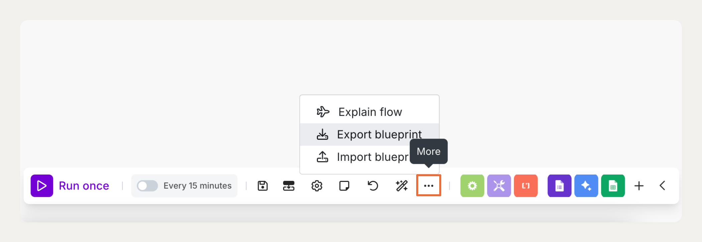

# O projeto e a avaliação

> Esse projeto será avaliado com base em uma rúbrica. As rúbricas ficam disponíveis nas lições dos projetos, onde cada pessoa estudante consegue entender como será avaliado. Você usará esse material para avaliar!

> A pessoa estudante vai entrega um link do google apresentações e dentro dela deve existir:

- [ ]  Um link para o seu cenário no Make
- [ ]  Um link para o seu Google Sheets com os dados de teste
- [ ]  Uma explicação clara de como sua automação funciona (recomenda-se incluir um diagrama do fluxo)
- [ ]  Ideias sobre melhorias que você implementaria com mais tempo ou ferramentas
- [ ]  (Opcional) Uma captura de tela do alerta de e-mail em funcionamento

---

## Projeto - Automatizar a análise de feedback do cliente com IA

Independentemente da área para a qual sua jornada profissional o leve — seja e-commerce, educação ou qualquer outro setor — processar o feedback dos clientes é essencial para aprimorar seu produto e construir confiança com seu público online.

Neste projeto, você assumirá o papel de um Gerente de Sucesso do Cliente em uma pequena empresa digital. Você precisará de uma forma clara e eficiente de coletar, analisar e agir com base no feedback dos clientes. Caso contrário, corre o risco de perder oportunidades de aumentar a satisfação dos usuários ou até enfrentar um problema de relações públicas causado por clientes insatisfeitos.

Sua tarefa será criar um fluxo de trabalho automatizado que colete o feedback dos clientes, utilize IA para analisá-lo e transforme essas informações em insights acionáveis, que possam ser compartilhados com sua equipe em tempo real.

Neste projeto, você utilizará as seguintes ferramentas:

- **Google Forms** para coletar feedback
- **Make** para automatizar o fluxo
- **Gemini AI** para analisar o sentimento e resumir as mensagens
- **Google Sheets** para armazenar os dados estruturados

## Seu objetivo

Seu objetivo é criar um sistema automatizado de análise de feedback que seja capaz de:

1. Coletar feedback
2. Enviar o feedback para a Gemini AI
3. Retornar um resultado estruturado:
    - **Sentimento** — Positivo / Neutro / Negativo
    - **Resumo** — um breve resumo da mensagem em 1 ou 2 frases
4. Armazenar o resultado em uma planilha do Google
5. Disparar um alerta por e-mail para sentimentos negativos (opcional, mas recomendado)

## Instruções do projeto

### 1. Configure a entrada de dados

Crie um Google Form com **duas perguntas**:

1. **"Qual o seu nível de satisfação com nosso produto ou serviço?"**
(Múltipla escolha: Muito satisfeito / Satisfeito / Neutro / Insatisfeito / Muito insatisfeito)
2. **"Descreva sua experiência ou compartilhe seu feedback com suas próprias palavras."**
(Parágrafo)

Envie pelo menos 5 a 7 respostas de teste com conteúdos variados.

### 2. Conecte o formulário ao Make

Configure um gatilho para ser acionado sempre que um novo feedback for enviado.

### 3. **Envie os dados para o Gemini**

Utilize o módulo **Gemini 2.5 Flash** com o seguinte comando como base:

> Classifique o sentimento deste feedback como Positivo, Neutro ou Negativo. Em seguida, resuma-o em uma frase.
> 
> Apresente sua resposta exatamente da seguinte forma:
> 
> `{ "sentimento": "[Positivo/Neutro/Negativo]", "resumo": "[Seu resumo aqui]" }`

Dito isso, este é apenas um ponto de partida. O prompt acima, por si só, pode não retornar um JSON válido para essa tarefa. Você precisará aplicar suas habilidades de engenharia de prompt para ajustá-lo e garantir que os resultados estejam no formato desejado.

> **Por que esse formato?** Esse formato é chamado de **JSON** — uma maneira simples e estruturada de organizar informações para que possam ser facilmente interpretadas por um computador. Você não precisa dominar JSON em detalhes; pense nele como uma lista organizada entre chaves que descreve claramente cada dado.

### 4. Analisar a resposta do LLM

Assim que o Gemini retornar a resposta, utilize o **módulo de análise JSON** do Make para interpretá-la.

Essa etapa extrai os campos "sentimento" e "resumo" gerados pela IA, permitindo que sejam utilizados nas próximas etapas do fluxo.

> **Importante:** Se a saída do Gemini não corresponder exatamente ao formato JSON esperado, o analisador pode falhar ou interpretar incorretamente os dados. Por isso, é essencial garantir que o prompt produza uma resposta consistente e bem estruturada.

### 5. Armazenar os resultados no Google Sheets

Crie colunas na planilha para armazenar:

- Sentimento
- Resumo
- Data e hora

### 6. (Opcional) Alertas por e-mail

Caso o sentimento identificado seja "Negativo", configure o envio automático de um alerta para o seu e-mail, incluindo um resumo do feedback e um link para a planilha do Google.

### 7. Prepare uma apresentação

Após concluir o fluxo, você deverá resumir seu trabalho em uma apresentação clara e estruturada. O objetivo é explicar o que foi criado, como funciona e quais insights podem ser gerados.

Preparamos um modelo no Google Slides para ajudar você a começar. Ele segue a estrutura deste projeto e inclui exemplos de conteúdo para cada slide.

Modelo: [Fluxo de Análise Automatizada de Feedback](https://docs.google.com/presentation/d/1vBW0CbjXSoKvdtW3KxWcOIt5d_Gq8U7Q7_KHugv5VXQ/edit?usp=sharing)

Clique em **“Fazer uma cópia”** para salvar uma versão no seu Google Drive.

- Renomeie o arquivo incluindo seu nome completo, por exemplo: **Análise Automatizada de Feedback – [Seu Nome Completo]**
- Adicione seu nome completo ao slide de introdução
- Substitua todo o conteúdo de exemplo pelo seu próprio fluxo, capturas de tela e aprendizados
- Exclua o slide de instruções e quaisquer slides não utilizados antes da entrega

### Compartilhe seu cenário

1. Em **Criar**, clique no menu **Mais** (três pontos) na parte inferior do editor de cenários.
2. Selecione **Exportar projeto** (consulte a captura de tela). Isso fará o download do seu cenário como um arquivo JSON.
3. Faça o upload do arquivo exportado para o seu Google Drive.
4. Gere um link compartilhável (configure para que **"Qualquer pessoa com o link possa visualizar"**).
5. Cole esse link no seu documento de apresentação, juntamente com a descrição do seu projeto.

---

## Rubrica do projeto

| **Critério** | **Excelente 🟢** | **Bom 🟡** | **Precisa de melhoria 🟠** | **Faltou 🔴** |
| --- | --- | --- | --- | --- |
| Configuração do Fluxo de Automação | O fluxo está totalmente automatizado do Google Form → IA → Google Sheets, sem etapas manuais. Todos os componentes (gatilhos, ações e integrações) funcionam corretamente e foram testados com múltiplos envios. | O fluxo está majoritariamente funcional, com pequenos problemas de configuração (ex: uma etapa exige ajuste manual ocasional ou apresenta erros esporádicos). | O fluxo está parcialmente funcional; algumas conexões estão quebradas ou exigem intervenção manual frequente. | Não há fluxo funcional ou as conexões estão ausentes. |
| Criação de Prompt e Processamento da Saída | O prompt solicita claramente sentimento e resumo; as saídas são precisas e bem formatadas. A extração dos dados é automatizada e sem erros. | O prompt funciona, mas pode precisar de pequenos ajustes (ex: classificação inconsistente ou erros ocasionais de formatação). | O prompt ou a extração geram erros frequentes ou exigem correções manuais. | Não há uso de prompt de IA ou os dados não são processados. |
| Estrutura de Dados no Google Sheets | Os dados estão organizados de forma clara, com colunas adequadas (nível de satisfação, feedback, sentimento, resumo, data/hora). Sem duplicações ou dados ausentes. | Os dados estão organizados, mas com pequenos problemas de formatação (ex: colunas extras ou inconsistência nos registros de data/hora). | Os dados estão incompletos ou desorganizados, dificultando a análise. | Nenhum dado foi armazenado no Google Sheets. |
| Clareza da Demonstração e Apresentação | A apresentação é clara, objetiva e bem estruturada. O fluxo é explicado de forma lógica, com capturas de tela ou diagramas. O aluno também sugere melhorias futuras. | A demonstração é compreensível, mas falta detalhamento ou evidências visuais. Pequenas lacunas na explicação. | A documentação é limitada ou pouco clara, com ausência de elementos importantes. | Nenhuma apresentação foi enviada. |
| Opcional: Alerta por E-mail para Feedback Negativo | O alerta por e-mail funciona corretamente e é acionado para feedbacks negativos ou insatisfatórios. | O alerta foi configurado, mas não foi totalmente testado ou apresenta pequenos erros. | O alerta foi parcialmente implementado e não é confiável. | Nenhum alerta foi implementado. |
| Criatividade | O projeto inclui elementos criativos, como interface bem elaborada, filtros no Sheets, integração com Slack ou lógica de fallback para erros. | Alguns elementos extras foram adicionados, mas com escopo limitado ou funcionamento incompleto. | Elementos adicionais mínimos ou inacabados. | Nenhuma melhoria além dos requisitos básicos. |

