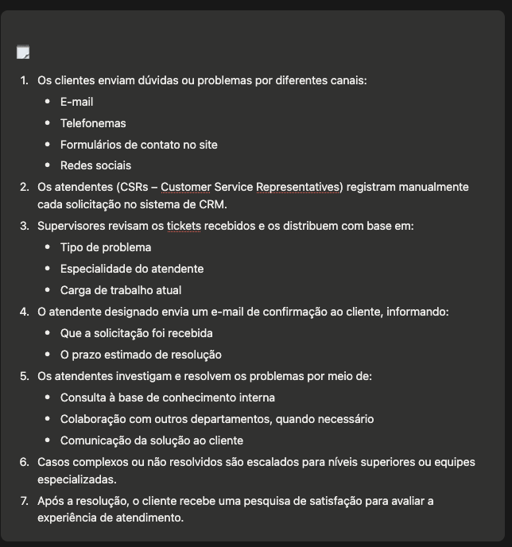
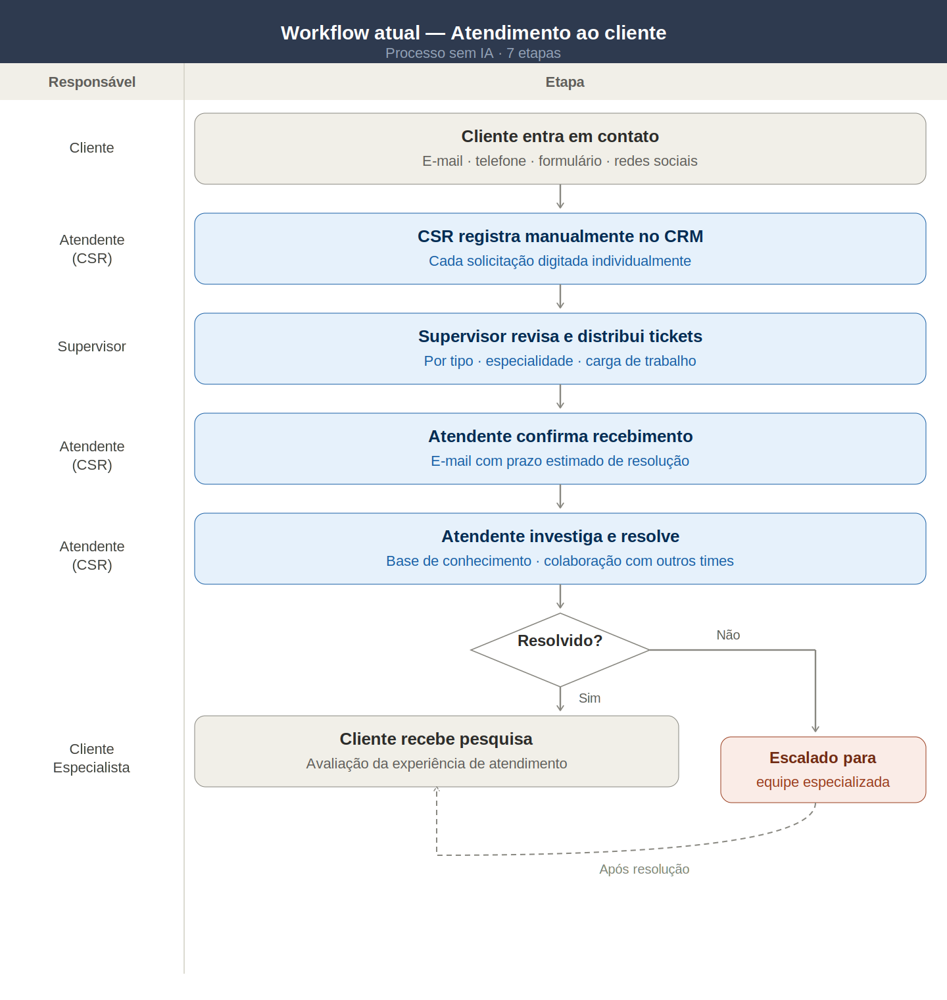
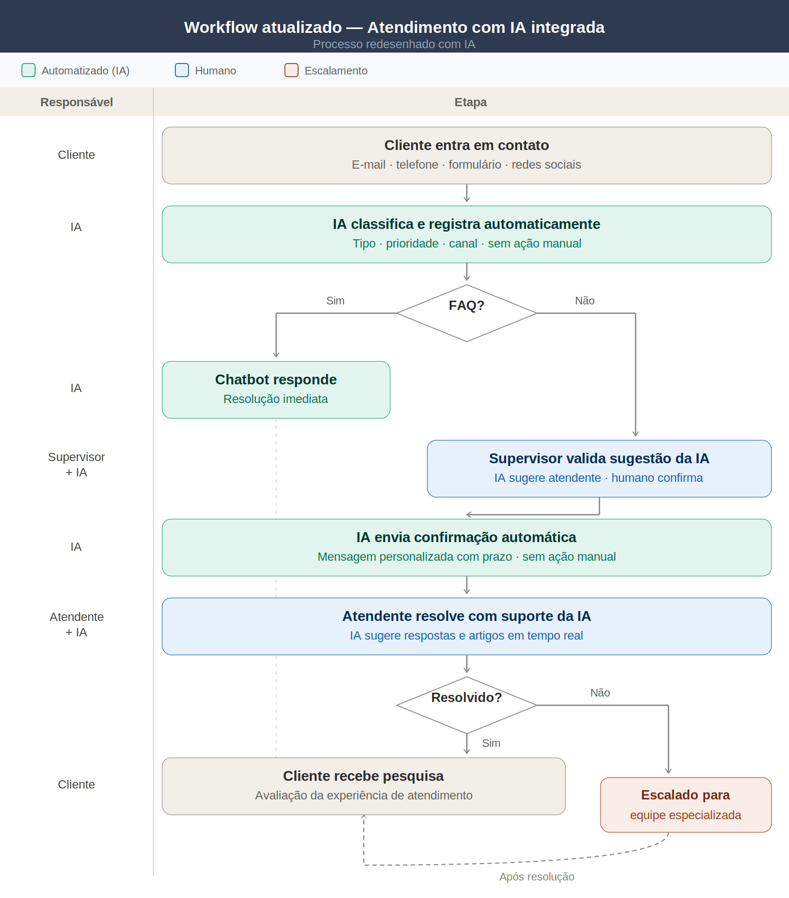
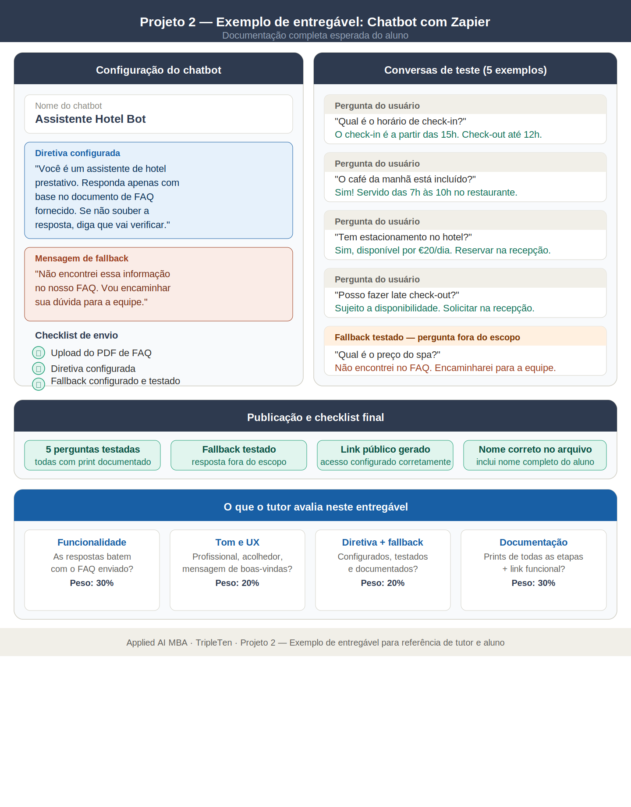
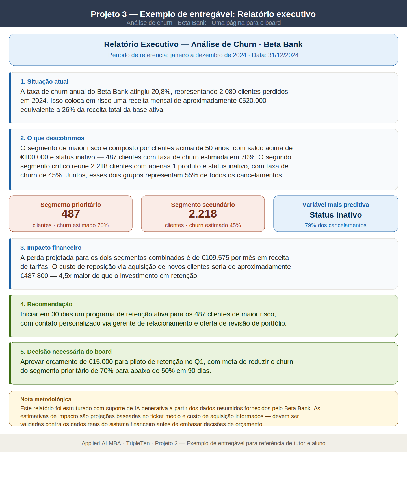
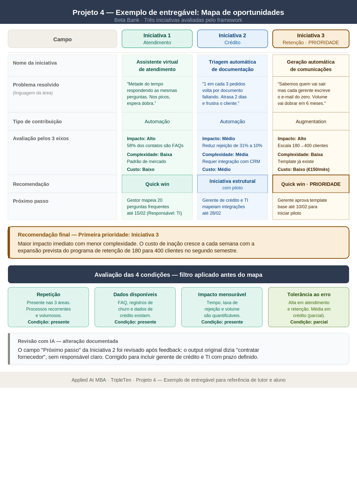

### Guia para Tutores

## Como usar este documento

Esta rubrica é o instrumento de avaliação unificado para os quatro projetos do Módulo 1. Ela traduz os critérios qualitativos de cada enunciado em pontuação objetiva, com faixas de nota e orientações para o tutor que vai avaliar.

O sistema adota **nota por faixa**, não por soma de itens. Isso significa que o tutor lê o entregável, identifica qual faixa de desempenho ele atende de forma consistente e atribui a nota correspondente. Itens isolados excepcionais não elevam a nota se o conjunto não sustenta a faixa superior.

**Escala de notas:** 0 a 10, com faixas de 2 pontos (0–4 / 5–6 / 7–8 / 9–10).

Exemplo de planilha para a avaliação de aluno: 

[planilha_notas_modulo1.xlsx](https://docs.google.com/spreadsheets/d/1SBagZPi87j-VNwxRyK_OwZEW8SMIyK639lSvyeCjKlA/edit?usp=sharing)

## Projeto 1 · Sprint 1 — Solução com IA para um Desafio de Negócio

### O que este projeto avalia

A capacidade de o aluno analisar um processo existente, identificar ineficiências com base em dados reais e propor soluções de IA com lógica aplicada ao negócio, não a tecnologia pela tecnologia.

### O que são os dois diagramas

**Workflow atual** é o mapa visual do processo de atendimento ao cliente como ele funciona hoje, antes de qualquer melhoria a partir do enunciado abaixo. O enunciado descreve 7 etapas: o cliente contacta o banco por um dos canais → o CSR registra manualmente no CRM → o supervisor revisa e distribui os tickets → o atendente designado envia confirmação ao cliente → o atendente investiga e resolve → casos complexos são escalados → o cliente responde a uma pesquisa de satisfação. O aluno deve representar isso visualmente com as áreas responsáveis em cada etapa, não apenas listar as etapas em texto.

Enunciado para a criacao do workflow atual:

**Workflow atualizado** é o mesmo fluxo, redesenhado depois que o aluno define as soluções com IA. Ele deve mostrar exatamente onde a IA entra no processo, o que ela substitui ou apoia e o que continua sendo executado por humanos. Por exemplo: se o aluno propôs um chatbot para perguntas repetitivas, o diagrama atualizado deve mostrar esse chatbot operando antes da triagem manual, com uma bifurcação — perguntas simples resolvidas automaticamente, casos que excedem o escopo do bot encaminhados para o atendente humano. A distinção visual entre etapas automatizadas e humanas é o critério central deste entregável.

O que conecta os dois diagramas é a lógica do projeto inteiro: o aluno parte do estado atual, identifica os problemas, propõe soluções e então redesenha o fluxo refletindo essas mudanças. O tutor deve verificar se o workflow atualizado é consistente com o que foi proposto nas soluções — se o aluno propôs automação de triagem mas o diagrama não mostra essa mudança, há inconsistência que invalida o entregável de síntese.

### Dimensões e peso

| Dimensão | Peso |
| --- | --- |
| Diagrama do workflow atual | 20% |
| Identificação de problemas | 25% |
| Soluções com IA propostas | 25% |
| Diagrama do workflow atualizado | 15% |
| Estrutura da apresentação | 15% |

### Faixas de desempenho

| Critério | Excelente 🟢9–10 | Bom 🟡7–8 | Precisa Melhorar 🟠5–6 | Ausente 🔴0–4  |
| --- | --- | --- | --- | --- |
| Diagrama do workflow atual | O diagrama visual representa claramente todo o processo de atendimento, com as 7 etapas incluídas e na ordem correta. Papéis e responsabilidades estão indicados. Layout limpo e fácil de entender. | O diagrama inclui a maioria das etapas e papéis, com pequenas imprecisões ou rótulos ausentes. Estrutura geralmente clara. | Diagrama incompleto ou confuso (ex.: apenas 3–4 etapas, papéis ausentes). Fluxo difícil de interpretar. | Nenhum diagrama significativo ou apenas anotações vagas. |
| Identificação de problemas | Identifica 3 ou mais problemas distintos, claramente ligados a etapas específicas do workflow e a padrões das reclamações. As explicações demonstram entendimento do impacto no cliente e no processo. | Identifica 2–3 problemas relevantes, com alguma conexão ao workflow ou ao feedback, mas com pouca profundidade ou clareza. | Menos de 3 problemas ou explicações vagas, repetitivas ou sem ligação clara com os dados. | Nenhum problema identificado ou sem referência ao workflow ou às reclamações. |
| Uso de dados de reclamações + ferramentas de IA | Os dados de reclamações são resumidos de forma significativa (manual ou via IA). O aluno descreve brevemente como ferramentas de IA (ex.: ChatGPT) ajudaram na análise ou no resumo. | As reclamações são usadas com algum insight; o uso de IA é mencionado, mas pouco explicado. | Análise mínima das reclamações. Ferramentas de IA são citadas de forma vaga ou pouco relevante. | Não há uso de dados de reclamações nem de ferramentas de IA. |
| Soluções com IA propostas | Propõe 2 ou mais soluções realistas, diretamente ligadas aos problemas identificados. Cada ferramenta é explicada com justificativa clara para seu uso. | As ferramentas são relevantes, mas não totalmente justificadas ou alinhadas a problemas específicos do workflow. | Sugestões genéricas ou mal conectadas. Explicações pouco claras ou sem lógica prática. | Nenhuma solução proposta ou ferramentas sem relação com o projeto. |
| Diagrama do workflow atualizado | O diagrama revisado reflete claramente a integração com IA. Tarefas automatizadas e humanas são distinguíveis. Mudanças são fáceis de acompanhar. Visual limpo e organizado. | O diagrama inclui a maioria das atualizações, mas pode faltar clareza ou consistência nos rótulos. Diferença entre humano e IA pouco evidente. | Diagrama confuso ou desorganizado. Integrações com IA não estão claras ou explicadas. | Nenhum diagrama atualizado apresentado. |
| Benefícios e riscos | Explica claramente como a IA melhora o workflow e a experiência do cliente. Pelo menos um risco ou limitação é reconhecido e explicado. | Benefícios bem descritos; riscos mencionados de forma breve ou pouco clara. | Benefícios vagos. Riscos não mencionados ou excessivamente genéricos. | Nenhuma reflexão sobre benefícios ou riscos. |
| Estrutura da apresentação | Segue a estrutura exigida e inclui todos os slides-chave. Nome do aluno no slide inicial e no nome do arquivo. Slides de instrução removidos. Visual limpo e fácil de acompanhar. | Estrutura quase completa. Um ou dois problemas menores (ex.: nome ausente, layout confuso, slide não removido). | Slides desorganizados ou incompletos. Vários problemas de estrutura ou formatação. | Estrutura ausente ou confusa. |
| Raciocínio geral e comunicação | Demonstra raciocínio claro, escolhas bem pensadas e fluxo lógico ao longo do projeto. Linguagem objetiva e fácil de entender. | Mostra compreensão geral da tarefa, com raciocínio claro em partes, embora algumas seções pareçam apressadas ou confusas. | Trabalho superficial ou desconectado; ideias difíceis de acompanhar. | Falta lógica ou coerência. Nenhuma evidência de engajamento com a tarefa. |

### Orientações para o tutor

A dimensão de maior peso é a identificação de problemas. Um aluno que desenha bem o diagrama mas não articula os problemas com base nos dados de reclamações não atingiu o objetivo central. Da mesma forma, soluções que citam "IA" de forma genérica — sem nomear a ferramenta, sem conectar ao problema específico e sem justificar a escolha — não devem ser avaliadas como boas, mesmo que tecnicamente plausíveis.

O workflow atualizado é o entregável de síntese do projeto. O teste principal é a consistência: cada mudança no diagrama atualizado deve ter correspondência direta em uma solução proposta na etapa anterior. Se o aluno adicionou um "sistema de triagem automática" no diagrama mas não descreveu essa solução antes, o entregável é incoerente. Se propôs automação de escalonamento mas o diagrama atualizado não mostra essa mudança, a proposta ficou no papel.

Um segundo sinal importante: o workflow atualizado não precisa ser sofisticado visualmente, mas precisa ser legível e autoexplicativo. Se o tutor precisa ler o texto da apresentação para entender o que mudou no diagrama, o diagrama não cumpriu sua função.

## Projeto 2 · Sprint 2 — Criando um Chatbot com o Zapier

### O que este projeto avalia

A capacidade de o aluno configurar uma solução de IA funcional, com base de conhecimento real, e documentar o processo com evidências concretas. O foco é na qualidade da implementação e na clareza da documentação, não na sofisticação técnica.

### Dimensões e peso

| Dimensão | Peso |
| --- | --- |
| Funcionalidade (respostas corretas com base no documento) | 30% |
| Experiência do usuário (tom, mensagem inicial, clareza) | 20% |
| Customização (diretiva + fallback configurados) | 20% |
| Testes e documentação (prints + conversas) | 20% |
| Publicação e envio (link funcional, nome correto) | 10% |

### Faixas de desempenho
| **Critério** | **Excelente** 🟢 **9–10** | **Bom** 🟡 **7–8** | **Precisa Melhorar** 🟠 **5–6** | **Ausente** 🔴 **0–4** |
| --- | --- | --- | --- | --- |
| **Funcionalidade** | Responde corretamente com base no documento. As respostas refletem a intenção da pergunta. | Responde a maioria das perguntas corretamente, com pequenas imprecisões. | Respostas inconsistentes, vagas ou incompletas. | Chatbot não funciona ou respostas irrelevantes. |
| **Experiência do usuário** | Respostas claras, úteis, tom profissional e acolhedor. Boa mensagem inicial. | Tom geralmente adequado, mas com respostas genéricas ou estranhas. | Respostas confusas, robóticas ou tom inconsistente. | Sem tom definido ou mensagem inicial. |
| **Customização (diretiva + fallback)** | Diretiva clara e adequada ao cenário + fallback funcional e testado. | Diretiva e fallback presentes, mas genéricos. | Diretiva ou fallback incompletos. | Nenhuma diretiva ou fallback configurados. |
| **Testes e documentação** | 5 ou mais perguntas testadas com prints. Prints mostram upload, diretiva e configurações. | Maioria dos passos documentados, mas faltam 1–2 elementos. | Documentação incompleta ou poucos testes. | Sem prints, testes ou explicações. |
| **Publicação e envio** | Chatbot publicado, link funcional, nome correto e acesso configurado. | Publicado, mas com erro de nome ou acesso. | Link não funciona ou chatbot não publicado corretamente. | Nenhum chatbot enviado. |

### Orientações para o tutor

Este é um projeto de execução. A funcionalidade tem o maior peso porque o objetivo declarado é criar um assistente que responde com base em conhecimento fornecido. Um chatbot bonito que responde errado não cumpre o objetivo.

O fallback é um sinal de maturidade: o aluno que o configura entende que a IA tem limites e não tenta esconder isso. Valorize essa escolha no feedback, mesmo que a configuração seja simples.

Não penalize ausência de sofisticação técnica. Penalize ausência de evidência. Se não há print, o tutor não pode verificar.

## Projeto 3 · Sprint 3 — Análise de Churn com IA

### O que este projeto avalia

A capacidade de o aluno conduzir uma análise estruturada com IA, aplicar técnicas de validação crítica, estimar custo e comunicar os resultados de forma adequada para três audiências distintas. É o projeto de maior complexidade do Módulo 1.

### Dimensões e peso

| Dimensão | Peso |
| --- | --- |
| Processo de análise (prompts, ferramenta, encadeamento) | 25% |
| Validação crítica (Sanity Check, Reverse Validation, Matriz) | 25% |
| Relatório executivo (6 elementos, linguagem, nota de confiança) | 30% |
| Custo (tabela preenchida, justificativa, reflexão) | 20% |

### Faixas de desempenho

| **Critério** | **Excelente** 🟢 **9–10** | **Bom** 🟡 **7–8** | **Precisa Melhorar** 🟠 **5–6** | **Ausente** 🔴 **0–4** |
| --- | --- | --- | --- | --- |
| **Processo de análise** | Problema de negócio formulado antes de abrir qualquer ferramenta. Prompts seguem os 4 pilares em todas as etapas. Prompt encadeado usado no aprofundamento. | Problema formulado de forma genérica. Prompts com a maioria dos pilares, com lacunas em um ou dois. | Problema não formulado separadamente. Prompts sem estrutura clara. | Nenhum registro de processo. Prompts ausentes ou colados sem análise. |
| **Validação crítica** | Sanity Check documentado com pelo menos uma afirmação questionada e desfecho registrado. Reverse Validation aplicado nos números financeiros. Matriz de Confiança usada com registro de alterações. | Validação aplicada mas com documentação superficial. Nenhuma afirmação efetivamente corrigida. | Validação mencionada mas sem evidência de output questionado. | Nenhuma validação crítica aplicada. |
| **Relatório executivo** | Segue os 6 elementos, em uma página, começa pela conclusão, nota de confiança com ressalvas reais, linguagem executiva. Três versões produzidas (board / gerente / equipe de dados). | Relatório estruturado com pequenas lacunas. Não começa pela conclusão ou falta nota de confiança. Versões com variação de qualidade. | Fora dos 6 elementos ou com linguagem técnica. Apenas uma ou duas versões produzidas. | Relatório ausente ou ilegível para o board. |
| **Custo** | Tabela de custo preenchida para todas as etapas com justificativa de modelo específica. Reflexão sobre custo mensal respondida com raciocínio explícito. | Tabela preenchida mas justificativas repetitivas ou pouco específicas. | Tabela incompleta ou reflexão ausente. | Nenhuma tabela de custo. |

### Orientações para o tutor

O peso maior é o relatório executivo porque é o entregável de maior visibilidade no contexto de negócio. Um processo bem documentado sem relatório adequado não é aprovável, conforme o próprio enunciado instrui.

O critério mais difícil de avaliar é a validação crítica. Fique atento ao seguinte sinal: se o aluno declara que aplicou o Sanity Check mas não documenta nenhuma afirmação questionada ou corrigida, a validação foi decorativa, não real. Isso não deve ser avaliado como excelente.

Para a nota de confiança, verifique se as ressalvas são reais e específicas ao projeto. Ressalvas genéricas ("a análise pode conter erros") não cumprem o critério.

## Projeto 4 · Sprint 4 — Mapeamento de Oportunidades de IA

### O que este projeto avalia

A capacidade de o aluno aplicar um framework estruturado para identificar e priorizar oportunidades de IA em contexto empresarial real, e traduzir a prioridade em um pitch executivo coerente e aprovável.

### Dimensões e peso

| Dimensão | Peso |
| --- | --- |
| Avaliação das 4 condições (por área) | 20% |
| Preenchimento do mapa (7 campos × 3 iniciativas) | 30% |
| Priorização pelo framework (3 eixos + justificativa) | 20% |
| Pitch executivo (6 elementos + 3 perguntas respondidas) | 30% |

### Faixas de desempenho

| **Critério** | **Excelente** 🟢 **9–10** | **Bom** 🟡 **7–8** | **Precisa Melhorar** 🟠 **5–6** | **Ausente** 🔴 **0–4** |
| --- | --- | --- | --- | --- |
| **Avaliação das 4 condições** | As 4 condições avaliadas para as 3 áreas com indicação de presente / parcial / ausente e justificativa específica baseada nos dados do contexto. | Condições avaliadas para as 3 áreas, mas justificativas genéricas em alguns casos. | Avaliação incompleta ou sem justificativa. | Condições não avaliadas. |
| **Preenchimento do mapa (7 campos × 3 iniciativas)** | 7 campos preenchidos para cada iniciativa com informação específica. 'Problema resolvido' na linguagem da área afetada, sem jargão técnico. 3 eixos com justificativa para cada classificação. | 7 campos preenchidos mas 'Problema resolvido' com linguagem técnica em uma iniciativa. Justificativas dos eixos superficiais. | Campos com informação genérica aplicável a qualquer empresa. Eixos classificados sem justificativa. | Mapa sem preenchimento significativo. |
| **Priorização pelo framework** | Recomendação de cada iniciativa coerente com os 3 eixos. Pelo menos uma iniciativa com recomendação diferente de quick win. Revisão com IA aplicada e pelo menos uma alteração documentada. | Priorização coerente mas sem documentar a revisão com IA. Todas as iniciativas com recomendação de quick win. | Priorização sem base explícita no framework. | Nenhuma priorização fundamentada. |
| **Pitch executivo + 3 perguntas** | 6 elementos na sequência certa, linguagem executiva, próximo passo com responsável e prazo, risco principal nomeado. 3 perguntas difíceis geradas e respondidas. Iniciativa do pitch = prioridade do mapa. | 6 elementos presentes mas próximo passo vago ou risco genérico. Perguntas geradas mas respostas superficiais. | Elementos ausentes ou fora de sequência. Perguntas não respondidas. | Pitch ausente ou sem estrutura. Incoerência entre mapa e pitch. |

### Orientações para o tutor

O sinal mais importante de qualidade neste projeto é a coerência entre o mapa e o pitch. Se a iniciativa do pitch for diferente da que saiu como prioridade do mapa, ou se a justificativa do pitch contradiz a avaliação dos eixos, o aluno não aplicou o framework com critério.

O segundo sinal é a presença de pelo menos uma iniciativa com recomendação diferente de quick win. O enunciado exige isso explicitamente como prova de que o framework foi aplicado com critério, não usado para justificar o que o aluno já queria recomendar.

Para o campo "Problema resolvido", aplique o teste mental: uma pessoa da área afetada reconheceria o próprio problema nessa frase? Se a resposta for não, o campo não está bem preenchido.

## Tabela de Referência Rápida

| Faixa | Nota | O que significa |
| --- | --- | --- |
| Excelente | 9–10 | Todos os critérios centrais atendidos com especificidade e coerência |
| Bom | 7–8 | Estrutura correta, execução com lacunas não críticas |
| Precisa Melhorar | 5–6 | Estrutura presente mas execução insuficiente em dimensões-chave |
| Insuficiente | 0–4 | Ausência de critérios centrais ou entregável incompleto |

## Critério de Aprovação Mínima

Nota mínima para aprovação: 7**,**0 em cada projeto.

Projetos com nota abaixo de 7,0 retornam para reenvio com feedback específico. O aluno tem 48 horas para ajuste após o feedback.

Projetos com nota 7,0 ou acima são aprovados e o feedback destaca os pontos fortes e, quando relevante, aponta o que poderia elevar para a faixa superior.

## Padrão de Feedback para o Tutor

Todo feedback deve incluir:

1. A nota atribuída e a faixa correspondente
2. O que justifica a nota (máximo 3 pontos específicos, referenciando o entregável)
3. O que precisa ser ajustado para aprovação ou para a próxima faixa (quando aplicável)
4. Um próximo passo concreto para o reenvio, quando houver

O feedback não deve: repetir o enunciado de volta ao aluno, listar todos os itens do checklist com status, ou dar uma nota sem justificativa específica ao entregável entregue.

| **Critério** | **Excelente** | **Bom** | **Precisa Melhorar** | **Ausente** |
| --- | --- | --- | --- | --- |
| **Diagrama do workflow atual** | O diagrama visual representa claramente todo o processo de atendimento, com as 7 etapas incluídas e na ordem correta. Papéis e responsabilidades estão indicados. Layout limpo e fácil de entender. | O diagrama inclui a maioria das etapas e papéis, com pequenas imprecisões ou rótulos ausentes. Estrutura geralmente clara. | Diagrama incompleto ou confuso (ex.: apenas 3–4 etapas, papéis ausentes). Fluxo difícil de interpretar. | Nenhum diagrama significativo ou apenas anotações vagas. |
| **Identificação de problemas** | Identifica 3 ou mais problemas distintos, claramente ligados a etapas específicas do workflow e a padrões das reclamações. As explicações demonstram entendimento do impacto no cliente e no processo. | Identifica 2–3 problemas relevantes, com alguma conexão ao workflow ou ao feedback, mas com pouca profundidade ou clareza. | Menos de 3 problemas ou explicações vagas, repetitivas ou sem ligação clara com os dados. | Nenhum problema identificado ou sem referência ao workflow ou às reclamações. |
| **Uso de dados de reclamações + ferramentas de IA** | Os dados de reclamações são resumidos de forma significativa (manual ou via IA). O aluno descreve brevemente como ferramentas de IA (ex.: ChatGPT) ajudaram na análise ou no resumo. | As reclamações são usadas com algum insight; o uso de IA é mencionado, mas pouco explicado. | Análise mínima das reclamações. Ferramentas de IA são citadas de forma vaga ou pouco relevante. | Não há uso de dados de reclamações nem de ferramentas de IA. |
| **Soluções com IA propostas** | Propõe 2 ou mais soluções realistas, diretamente ligadas aos problemas identificados. Cada ferramenta é explicada com justificativa clara para seu uso. | As ferramentas são relevantes, mas não totalmente justificadas ou alinhadas a problemas específicos do workflow. | Sugestões genéricas ou mal conectadas. Explicações pouco claras ou sem lógica prática. | Nenhuma solução proposta ou ferramentas sem relação com o projeto. |
| **Diagrama do workflow atualizado** | O diagrama revisado reflete claramente a integração com IA. Tarefas automatizadas e humanas são distinguíveis. Mudanças são fáceis de acompanhar. Visual limpo e organizado. | O diagrama inclui a maioria das atualizações, mas pode faltar clareza ou consistência nos rótulos. Diferença entre humano e IA pouco evidente. | Diagrama confuso ou desorganizado. Integrações com IA não estão claras ou explicadas. | Nenhum diagrama atualizado apresentado. |
| **Benefícios e riscos** | Explica claramente como a IA melhora o workflow e a experiência do cliente. Pelo menos um risco ou limitação é reconhecido e explicado. | Benefícios bem descritos; riscos mencionados de forma breve ou pouco clara. | Benefícios vagos. Riscos não mencionados ou excessivamente genéricos. | Nenhuma reflexão sobre benefícios ou riscos. |
| **Estrutura da apresentação** | Segue a estrutura exigida e inclui todos os slides-chave. Nome do aluno no slide inicial e no nome do arquivo. Slides de instrução removidos. Visual limpo e fácil de acompanhar. | Estrutura quase completa. Um ou dois problemas menores (ex.: nome ausente, layout confuso, slide não removido). | Slides desorganizados ou incompletos. Vários problemas de estrutura ou formatação. | Estrutura ausente ou confusa. |
| **Raciocínio geral e comunicação** | Demonstra raciocínio claro, escolhas bem pensadas e fluxo lógico ao longo do projeto. Linguagem objetiva e fácil de entender. | Mostra compreensão geral da tarefa, com raciocínio claro em partes, embora algumas seções pareçam apressadas ou confusas. | Trabalho superficial ou desconectado; ideias difíceis de acompanhar. | Falta lógica ou coerência. Nenhuma evidência de engajamento com a tarefa. |

 

| **Critério** | **Excelente** **9–10** | **Bom** **7–8** | **Precisa Melhorar** **5–6** | **Ausente** **0–4** |
| --- | --- | --- | --- | --- |
| **Funcionalidade** | Responde corretamente com base no documento. As respostas refletem a intenção da pergunta. | Responde a maioria das perguntas corretamente, com pequenas imprecisões. | Respostas inconsistentes, vagas ou incompletas. | Chatbot não funciona ou respostas irrelevantes. |
| **Experiência do usuário** | Respostas claras, úteis, tom profissional e acolhedor. Boa mensagem inicial. | Tom geralmente adequado, mas com respostas genéricas ou estranhas. | Respostas confusas, robóticas ou tom inconsistente. | Sem tom definido ou mensagem inicial. |
| **Customização (diretiva + fallback)** | Diretiva clara e adequada ao cenário + fallback funcional e testado. | Diretiva e fallback presentes, mas genéricos. | Diretiva ou fallback incompletos. | Nenhuma diretiva ou fallback configurados. |
| **Testes e documentação** | 5 ou mais perguntas testadas com prints. Prints mostram upload, diretiva e configurações. | Maioria dos passos documentados, mas faltam 1–2 elementos. | Documentação incompleta ou poucos testes. | Sem prints, testes ou explicações. |
| **Publicação e envio** | Chatbot publicado, link funcional, nome correto e acesso configurado. | Publicado, mas com erro de nome ou acesso. | Link não funciona ou chatbot não publicado corretamente. | Nenhum chatbot enviado. |